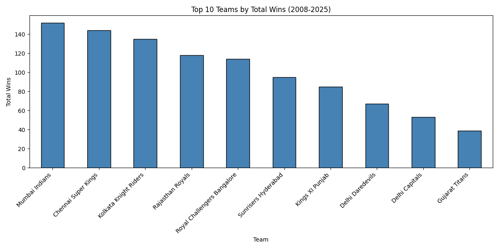
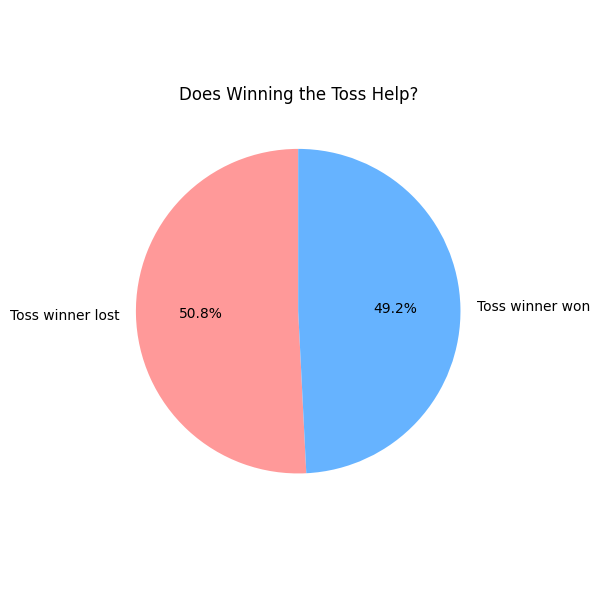
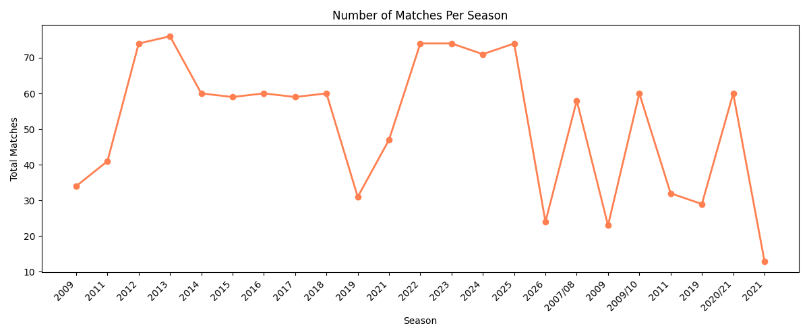
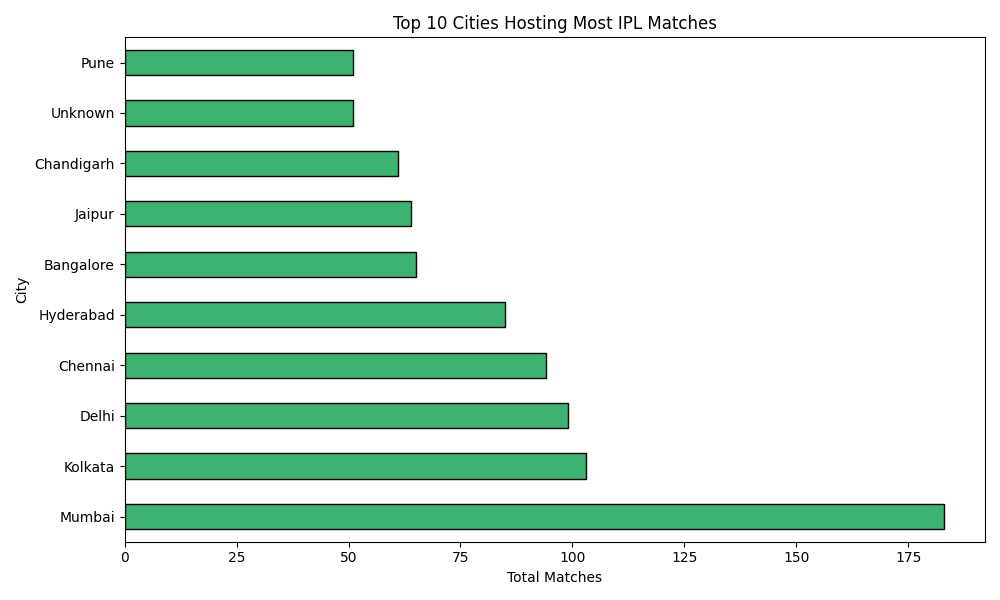
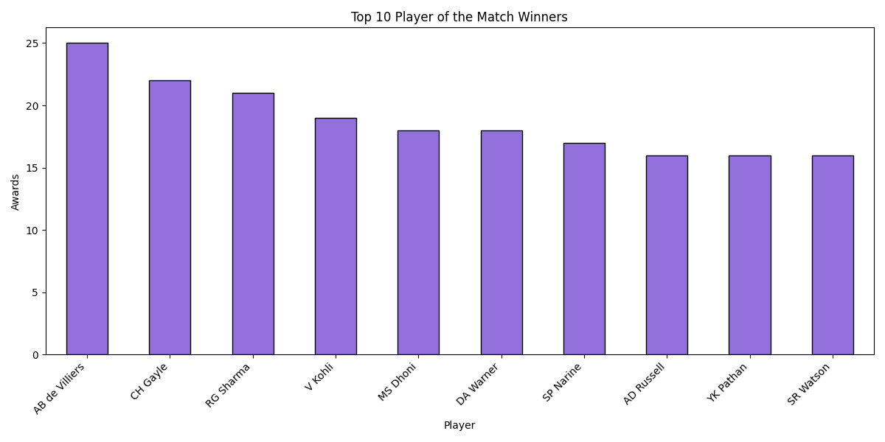

# IPL Match Performance Analysis (2008–2025)

## Overview
Exploratory data analysis on 1000+ IPL matches across 17 seasons 
using Python, SQL and Excel.

## Tools Used
- Python (pandas, matplotlib)
- SQL (SQLite)
- Excel (pivot tables, charts)

## Key Findings
1. MI and CSK are the most consistent winning teams
2. Toss impact is statistically overrated (~50% win rate)
3. IPL has grown from 60 to 74+ matches per season
4. Mumbai is the most frequently used IPL host city
5. AB de Villiers leads Player of the Match awards

## Files
- `ipl_matches.xlsx` — cleaned match-level dataset
- `IPL_Analysis.ipynb` — full analysis notebook
- `*.png` — chart exports

## How to Run
1. Clone the repo
2. Open `IPL_Analysis.ipynb` in Jupyter
3. Run all cells

## Visualisations

